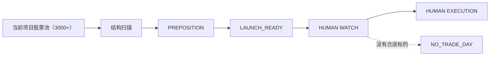

# 首板回踩再启动 / Second Launch Radar

> A-share research system for narrowing thousands of stocks into a small
> watchlist of structurally strong second-launch candidates.

## 这个项目解决什么问题

这不是一个自动预测涨停的系统，也不是机械寻找最低买点的工具。

核心目标是把当前股票池逐步缩小成一小份值得人工盯盘的候选。
（长期愿景是面向全市场扫描。）

`当前项目股票池（约3000+） → 找到第一次资金明显表态 → 判断回调后结构是否仍然健康 → 找到重新转强的股票 → 提前缩小到少量 PREPOSITION / LAUNCH_READY 候选 → 由人工盘中执行。`

## 策略怎么理解

策略围绕“第一次资金表态之后，结构是否还活着、能否再次发动”展开：

- **FIRST_ATTACK**：第一次资金明显表态（涨停或放量攻击）。
- **STRUCTURE_ALIVE**：表态后的回调/换手中，底部或平台结构没有被破坏。
- **RECLAIM**：价格重新站回短均线等关键位置，结构开始修复。
- **PREPOSITION**：结构健康且处于修复中，进入“值得继续观察”的预备位。
- **LAUNCH_READY**：次日值得重点盯盘的转强候选（常伴随接近 S1 / 近期高点等
  geometry 特征；这些只是特征，不构成确认）。
- **SECOND_LAUNCH**：第二次攻击确认——突破关键 trigger / 前高 / 压力区，并
  形成有效强势扩张。
- **POST_B**：主要启动段已经兑现，进入持仓管理 / 延续观察阶段；新开仓通常
  NO_CHASE。

文中统一使用客观描述：资金表态、结构保持、换手/分歧、重新转强、第二次攻击。
不把“主力洗盘 / 吸筹”写成事实。

## 流程

## Human + Machine 分工

**机器负责：**

- 扫描大量股票
- 识别结构状态
- 缩小观察范围
- 提供支撑 / invalid / S1 / G 等参考
- 保存历史与 forward evidence

**人工负责：**

- 判断当天盘口承接
- 判断板块环境
- 判断是否追高
- 决定是否真正交易

系统目标是优化“注意力分配”，**不是自动下单**。

## B 点是什么

B 不是一个固定价格。

B condition =

**PRICE ZONE**（进入计划区域）

**+ BEHAVIOR CONFIRMATION**（盘中表现符合预期）

**+ INVALIDATION**（风险失效位置明确）

盘前制定 → 盘中执行 → 盘后评价。

## 每日工作流

`当前股票池（3000+） → tens of structural candidates → 10-20 Human Watch → 3-5 重点观察 → 0-2 实际交易`

没有合适标的时间，允许 **NO TRADE**，不为交易强制选股。

## 当前研究认知

以下均为研究阶段的观察（research hypothesis），不是已验证的稳定盈利规则：

- 传统机械 B1 entry 尚未证明稳定正期望。
- “越便宜越好”没有得到支持。
- 强势候选往往本来就更靠近近期高点。
- G Geometry 更适合作为 LAUNCH_READY radar，而不是自动买入信号。
- RR / buy zone 更适合作 execution reference，而不是唯一 watch gate。
- Analog Engine 当前定位为 DESCRIPTIVE CASE RETRIEVAL，不用于预测 S1/S2。
- 技术指标只是辅助特征，不作为万能硬规则。

## 案例说明（仅供结构理解）

以下只作为 strategy archetype / observation case，**不是历史已验证的成功交易**：

- **600468 百利电气**：STRUCTURE_SUCCESS / SECOND_LAUNCH_SUCCESS
  （非 ENTRY_SUCCESS ground truth）
- **600756 浪潮软件**：OBSERVATION / HUMAN_SELECTED（人工低吸观察；数据受限）
- **603980 吉华集团**：OBSERVATION / PENDING（等待回踩支撑簇）
- **002112 三变科技**：FORWARD CASE / HUMAN_SELECTED（盘中人工观察）
- **大连电瓷**：MANUAL_REVIEW（仓库内无完整时间轴，待人工补证；不自行补造事实）

## 更多文档

- [docs/strategy-overview.md](docs/strategy-overview.md) — 策略概览（更详细）
- [docs/agent-context.md](docs/agent-context.md) — 工程上下文
- [docs/project-operating-model.md](docs/project-operating-model.md) — 四层 truth 模型
- [research/second_launch_radar_v1.md](research/second_launch_radar_v1.md) — research-only 雷达 spec
- 知识库：`a-share-strategy-brain`
